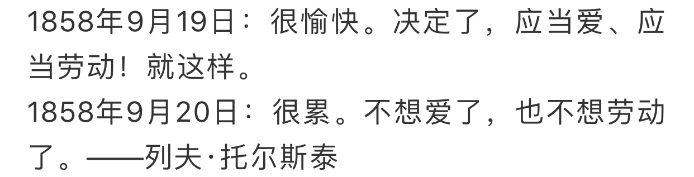

absolute定位是绝对定位，相对于它祖先第一个不是static的元素进行定位，这没问题，我们一般选择relative
但是如果relative元素不设置宽高 会导致子元素和relative的兄弟节点元素重叠。
因为absolute元素脱离了普通文档流 会被"正常页面流"忽略，即在"正常页面流"中，该元素所占空间为零，周边元素不受影响。
那么父级的relative元素就会失去高度。宽是是页面宽度，高度为0。
relative兄弟节点继续按文档流布局 就会出现覆盖的情况。


```
<body>
    <div style="position: relative;  background-color: yellow;">
        
    </div>
    <div style="position: relative;">
         
    </div>
</body>
```

